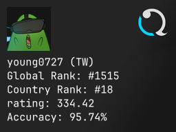

# quaver_stats

quaver_stats provides a simple api to get player stats card from the quaver game.

## Example

once you run the server, you can access the player stats card by visiting the following URL:

`https://localhost:3001/card/{username}`

for example, if you want to get the stats card for the user `young0727`, you can visit the following URL:

`https://localhost:3001/card/young0727`

the card image will be returned as a png file, and you can use it in your application or save it to your local machine.
