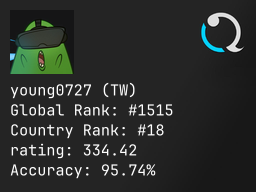

# quaver_stats

quaver_stats provides a simple api to get player stats card from the quaver game.


## Example

once you run the server, you can access the player stats card by visiting the following URL:

`https://localhost:3001/card/{username}`

for example, if you want to get the stats card for the user `young0727`, you can visit the following URL:

`https://localhost:3001/card/young0727`



the card image will be returned as a png file, and you can use it in your application or save it to your local machine.

## Nix

This repo ships a flake.

Run it directly:

```sh
nix run github:Young-TW/quaver_stats
# or from a local checkout
nix run .
```

Build the package:

```sh
nix build .#quaver_stats
./result/bin/quaver_stats
```

Development shell (provides `cargo`, `rustc`, `clippy`, `rustfmt`, `openssl`):

```sh
nix develop
cargo run   # serves on http://0.0.0.0:3001
```

The runtime-loaded background image is installed alongside the binary, and the
wrapper points `QUAVER_STATS_ASSETS_DIR` at it, so the package works from any
working directory. Override the variable to use a different assets directory.

### NixOS deployment

The flake exposes `nixosModules.default`. Add it to your system flake:

```nix
{
  inputs.quaver_stats.url = "github:Young-TW/quaver_stats";

  outputs = { nixpkgs, quaver_stats, ... }: {
    nixosConfigurations.myhost = nixpkgs.lib.nixosSystem {
      modules = [
        quaver_stats.nixosModules.default
        {
          services.quaver_stats.enable = true;
          services.quaver_stats.openFirewall = true; # opens TCP 3001
        }
      ];
    };
  };
}
```

This runs the server as a hardened `DynamicUser` systemd service listening on
port `3001`, caching avatars under `/var/cache/quaver_stats`.
